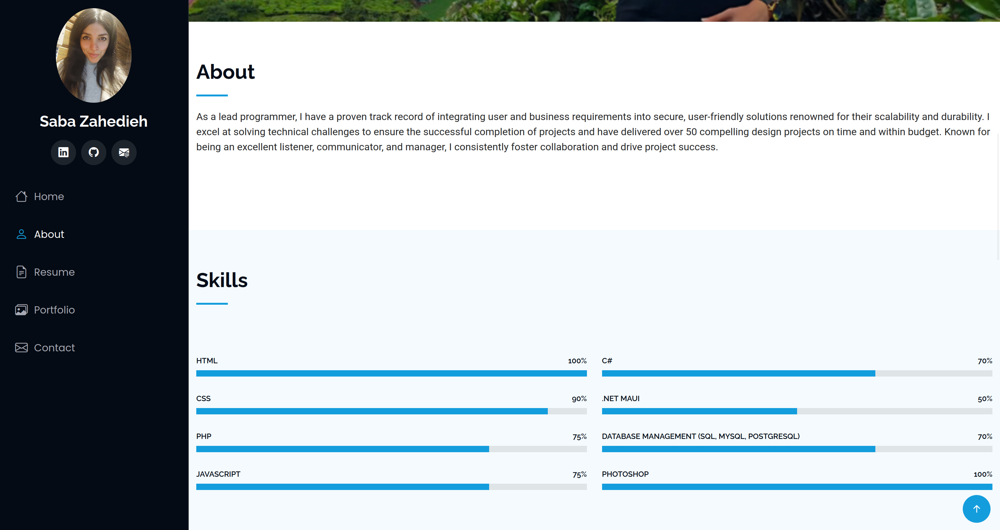

# 🌐 Portfolio Website

This repository contains the source code for my personal **portfolio
website**, built with **HTML, CSS, JavaScript, and Bootstrap**.\
The portfolio showcases several of my projects and provides links to
their respective GitHub repositories.

## 🚀 Overview

The website presents a clean and responsive interface where visitors can
explore the different projects I've worked on. Each listed project
includes a direct link to its GitHub repository, allowing users to view
source code, documentation, and technical details.

## 📂 Featured Projects

Below are some of the key projects showcased in the portfolio:
- [**Temo Project**](https://github.com/savize/Tesmo)
- [**CRM Project**](https://github.com/savize/CRM_SVZE)
- [**Dict Project**](https://github.com/savize/Dictionary)
- [**Mevs Project**](https://github.com/savize/MEVS_V2)

## 📸 Portfolio Preview

assets/img/port.png
assets/img/portCont.png
